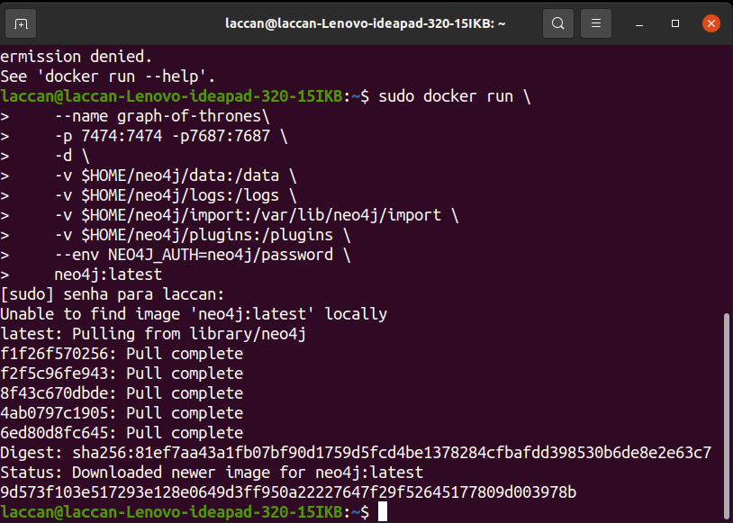
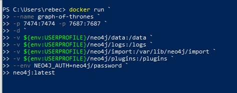
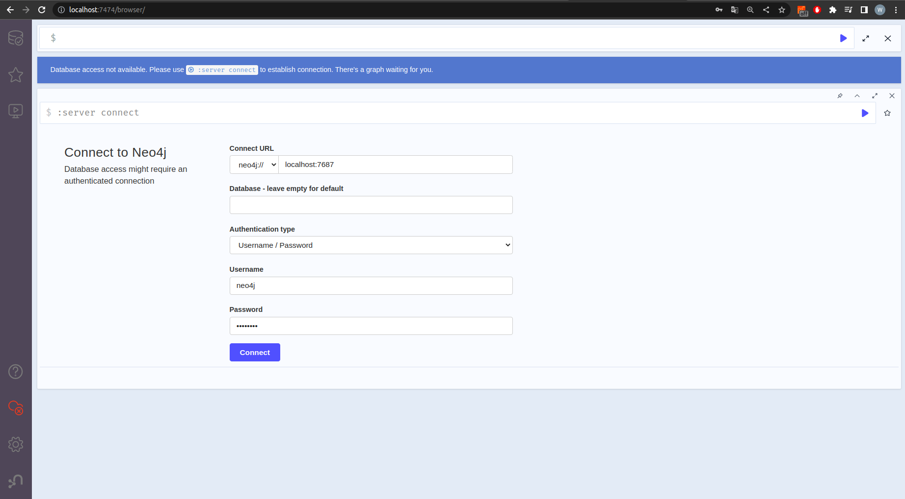
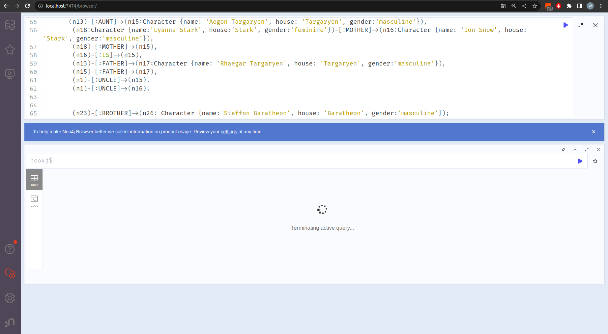
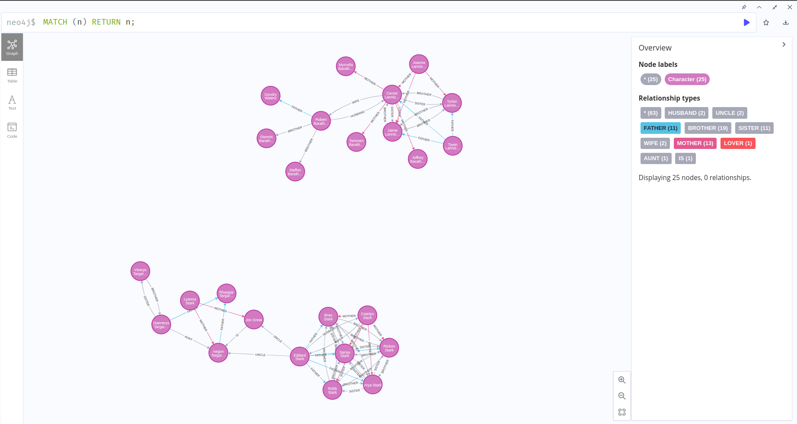
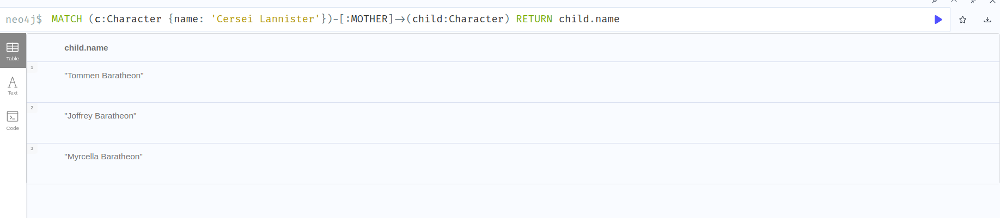
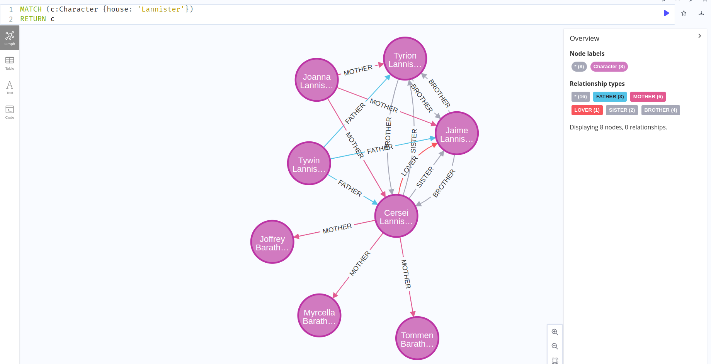
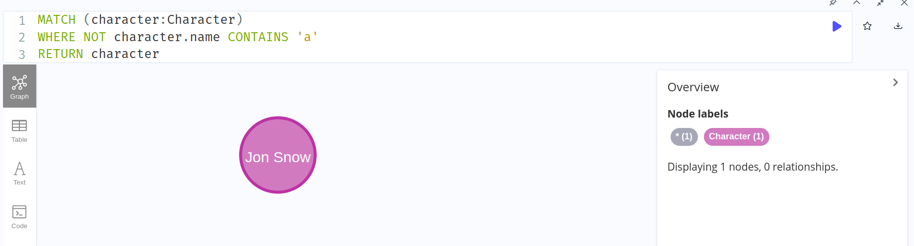
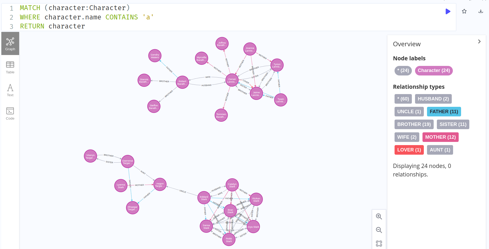
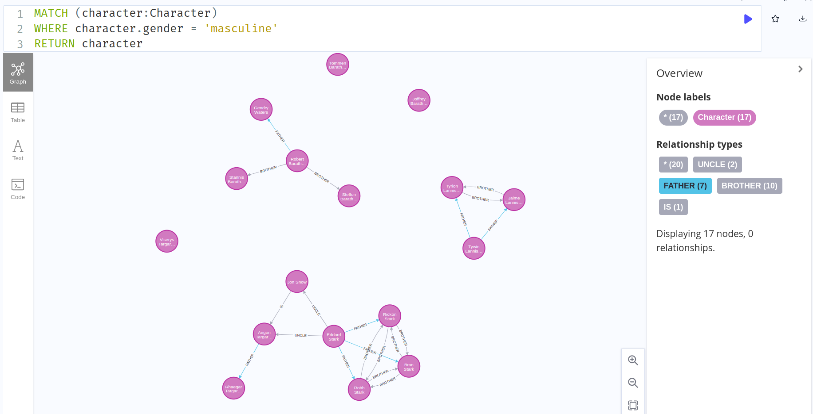

# Graph of Thrones :crown:

Produzido por: Rebeca Queiroz e Wemilly Souza.

## Sumário

1. [Introdução](#introdução)
2. [Modelagem](#modelagem)
3. [Instalação](#instalação)
4. [Consultas](#consultas)

### Introdução
Nesse projeto, usaremos um banco de dados baseado em grafos usando [Neo4j](https://neo4j.com/) e Docker para armazenar dados dos personagens da série chamada Game of Thrones.

A linguagem utilizada para interagir com os dados se chama (https://neo4j.com/developer/cypher/). Ela é usada pelo Neo4j como linguagem de query. Sendo assim, é com ela que faremos algumas consultas nesse tutorial.

Os dados foram inseridos de forma manual para explicar a relação entre eles. 

[Link](https://drive.google.com/file/d/117QPHGrUmj8zrfGb1ok99L-ndbGSx3CH/view?usp=sharing) para o tutorial.

### Modelagem
A modelagem de dados no Neo4j é realizada por meio de grafos, onde os nós representam as entidades e os relacionamentos entre eles representam as relações entre as entidades.

Neste modelo, cada personagem é representado como um nó com três propriedades: nome, casa à qual pertence e o gênero do personagem. Os relacionamentos entre eles são modelados como arestas direcionadas com rótulos que indicam a relação parental entre eles, como "FATHER" ou "MOTHER".

Essa abordagem permite representar relações complexas de forma clara e eficiente. Além disso, o uso de grafos permite consultas e análises rápidas e flexíveis, que podem ser utilizadas para obter insights valiosos em dados complexos.

### Instalação

1. **Criar um container Docker com a imagem do Neo4J**

   Primeiramente, vamos criar o container Docker com o Neo4J. Execute o seguinte comando no seu terminal:

No linux:
   ```bash
   docker run \
       --name graph-of-thrones \
       -p7474:7474 -p7687:7687 \
       -d \
       -v $HOME/neo4j/data:/data \
       -v $HOME/neo4j/logs:/logs \
       -v $HOME/neo4j/import:/var/lib/neo4j/import \
       -v $HOME/neo4j/plugins:/plugins \
       --env NEO4J_AUTH=neo4j/password \
       neo4j:latest
   ```

No windows:
```bash
        docker run `
        --name graph-of-thrones `
        -p 7474:7474 -p 7687:7687 `
        -d `
        -v ${env:USERPROFILE}/neo4j/data:/data `
        -v ${env:USERPROFILE}/neo4j/logs:/logs `
        -v ${env:USERPROFILE}/neo4j/import:/var/lib/neo4j/import `
        -v ${env:USERPROFILE}/neo4j/plugins:/plugins `
        --env NEO4J_AUTH=neo4j/password `
        neo4j:latest
```

   Esse comando irá baixar a imagem do Neo4J, caso não exista, criará um container automaticamente e o executará automaticamente.
   
   


   Antes de passar para o próximo passo, aguarde um pouco para que o servidor seja
   criado.

2. **Acessar o Neo4J no navegador**

   Após esperar uns segundos, coloque o seguinte URL na sua barra de seu navegador.

   ```
   http://localhost:7474/
   ```

   Caso o resultado tenha sido semelhante ao da imagem abaixo, então tudo certo!
   

    É necessário preencher os campos Username com “neo4j” e o Password com “password”, depois clique no botão “Connect” para conectar.

4. **Inserção dos dados**

   Para inserir os dados, vamos copiar o script do arquivo [`cyphercommands.txt`](./cyphercommands.txt) e vamos colar na barra de comandos que inicia com `neo4j$` no topo da página.
   Após isso, basta clicar no ícone Play ou dar enter que os dados serão inseridos.

   
    
   
### Consultas

    Para realizar as consultas, após adicionar os dados, usaremos alguns comandos Cypher.


1. **Para selecionar todos os nós e relacionamentos**

   ```cypher
   MATCH (n) RETURN n;
   ```

   

2. **Para selecionar os nós conectados por meio da relação "MOTHER" com o nó do nome da mãe**

    ```cypher 
    MATCH (c:Character {name: 'Cersei Lannister'})-[:MOTHER]->(child:Character) RETURN child.name
    ```
    

     ```cypher 
    MATCH (c:Character {name: 'Catelyn Stark'})-[:MOTHER]->(child:Character)
    RETURN child.name
    ```
    

3. **Para selecionar o nome de todos os personagens que pertencem à casa Lannister**

    ```cypher 
    MATCH (c:Character {house: 'Lannister'})
    RETURN c
    ```

    
4. **Para selecionar o nome de todos os personagens que não contêm a letra a no nome**
    ```cypher 
    MATCH (character:Character)
    WHERE NOT character.name CONTAINS 'a'
    RETURN character
    ```
    
    
5. **Para selecionar o nome de todos os personagens que contêm a letra a no nome**
    ```cypher 
    MATCH (character:Character)
    WHERE character.name CONTAINS 'a'
    RETURN character
    ```
    
    
5. **Para selecionar o nome de todos os personagens do gênero masculino**

    ```cypher
    MATCH (character:Character)
    WHERE character.gender = 'masculine'
    RETURN character
    ```
    
    

    
